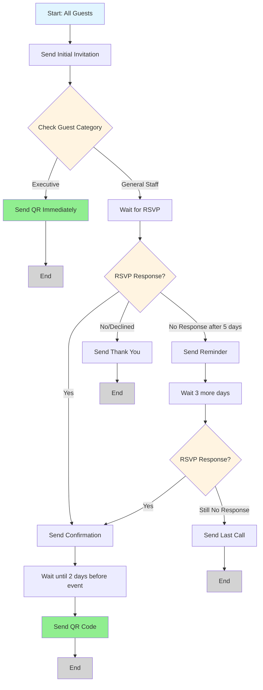

# BALEMOO - PRODUCT REQUIREMENTS DOCUMENT

---

# 6. FEATURE SPECIFICATIONS

---

## 6.1 KABAR.IN (Invitation & CRM Management)

Kabar.in is the first touchpoint in the guest journey, handling everything from event setup through invitation delivery and RSVP collection. It transforms the traditional invitation process from static paper or simple digital messages into an intelligent, automated communication system that adapts based on guest responses.

### Core Value Proposition

Traditional event invitations are one-way broadcasts with no tracking, no follow-up automation, and no ability to adjust messaging based on recipient behavior. Kabar.in solves this by providing:

1. **Template-based messaging** that complies with WhatsApp Business API requirements
2. **Visual flow builder** that allows non-technical users to design complex communication journeys
3. **Automated execution** that handles reminders, confirmations, and QR delivery without manual intervention
4. **Real-time tracking** that shows exactly where each guest is in the invitation process
5. **Centralized guest data** that feeds seamlessly into Check.in and Monitor.in

---

## 6.1.1 Event Creation & Management

The foundation of every guest management workflow starts with creating an event in Kabar.in.

**Event Types Supported:**
- Single events (one-time occasion: wedding, conference, gala)
- Recurring events (weekly training, monthly meetings)
- Multi-day events (3-day conference, weekend retreat)
- Series events (quarterly workshops, annual celebrations)

**Core Event Information:**

When creating an event, Admin configures:
- **Event name** and description
- **Event date & time** (start and end, timezone-aware)
- **Venue details** (physical address, online meeting link, or hybrid)
- **Event type** (wedding, corporate, workshop, seminar, gala, etc.)
- **Expected guest count** (used for capacity planning)
- **Host information** (organizer name, contact details)

**Event Duplication:**

For recurring clients or similar event types, Admin can duplicate an existing event to quickly create a new one. Duplication copies:
- Event structure and settings
- Template associations
- Chatflow designs (but not execution status)
- Table configurations

**What doesn't copy:** Guest lists, RSVP data, actual attendance records (these are unique to each event).

**Use Case:** D'Organizer runs quarterly training workshops. After first workshop, they duplicate the event for Q2, update the date and venue, import new guest list, and run the same proven chatflow.

---

## 6.1.2 Template Management

WhatsApp Business API requires all business-initiated messages to use pre-approved templates. Kabar.in provides a complete template lifecycle management system.

**Template Submission to META:**

Admin creates templates directly in Kabar.in interface and submits them to META (WhatsApp's parent company) for approval.

**Template Components:**
- **Template name** (internal reference, not shown to guests)
- **Template category** (Marketing, Utility, Authentication - affects approval likelihood)
- **Language** (Indonesian, English, or both)
- **Message content** with variable placeholders (e.g., {{guest_name}}, {{event_date}}, {{venue}})
- **Media attachments** (optional: header image, document)
- **Interactive buttons** (optional: Quick Reply buttons, Call-to-Action buttons)

**Template Preview:**

Before submitting to META, Admin sees live preview showing exactly how the message will appear in WhatsApp chat interface, including:
- How variables will be replaced with sample data
- Button layout and styling
- Image/document rendering
- Character count and formatting

**Approval Tracking:**

Once submitted, template status shows:
- **Pending** - Awaiting META review (typically 1-24 hours)
- **Approved** - Ready to use in chatflows
- **Rejected** - META declined (with reason if provided)

**Handling Rejections:**

If META rejects a template, Admin cannot edit it. Instead, Admin must:
1. Review rejection reason (if provided by META)
2. Create a new template with modifications
3. Submit new template for approval
4. Update chatflows to use new approved template when available

**Template Types Commonly Used:**

| Template Type | Purpose | Example Variables |
|---------------|---------|-------------------|
| **Initial Invitation** | First contact with guest | {{guest_name}}, {{event_name}}, {{event_date}}, {{venue}} |
| **RSVP Confirmation** | Acknowledge guest response | {{guest_name}}, {{rsvp_status}}, {{table_number}} |
| **Reminder** | Follow-up before event | {{guest_name}}, {{days_until_event}}, {{event_time}} |
| **QR Code Delivery** | Send check-in QR code | {{guest_name}}, {{qr_code_image}}, {{instructions}} |
| **Last Call** | Final reminder for non-responders | {{guest_name}}, {{deadline}}, {{rsvp_link}} |

**Permission Notes:**
- Super Admin and Event Admin can create and submit templates
- Staff/Volunteers cannot access template management
- Templates are project-independent (can be reused across multiple events)

---

## 6.1.3 Guest List Management

Every guest in Balemoo is automatically assigned a `unique_user_id` and `unique_qr_code` upon creation. These identifiers ensure accurate tracking throughout the entire guest journey.

**Import Methods:**

**1. CSV Import (Primary Method)**

Admin uploads CSV file with guest information. Required columns are minimal (typically just name and phone number), but Admin can include any custom fields needed for their event.

**Standard Fields:**
- Full name (required)
- Phone number with country code (required, e.g., +62812345678)
- Email address (optional, for email-based flows)
- Plus-one count (optional, default 0)

**Custom Fields (Admin-Defined):**

The CSV template is flexible. Admin can add any columns they need:
- Company name (corporate events)
- Department (for internal meetings)
- Dietary restrictions (catering planning)
- Guest category (VIP, Speaker, General Attendee, Family, Friend)
- Relationship (Bride's side, Groom's side)
- Special notes (wheelchair access, interpreter needed, etc.)

**Example CSV:**
```
name,phone,email,category,company,dietary
John Doe,+628123456789,john@example.com,VIP,Acme Corp,Vegetarian
Jane Smith,+628198765432,jane@example.com,Speaker,Tech Inc,None
Ahmad Wijaya,+628567891234,,General,PT Maju,Halal
```

**Automatic Processing:**

Upon successful import, system automatically:
- Generates `unique_user_id` for each guest (UUID format)
- Generates `unique_qr_code` for each guest (encrypted string containing user_id)
- Validates phone number format
- Flags duplicates if same phone number exists
- Creates guest record ready for chatflow processing

---

**2. Manual Guest Entry**

For small events or last-minute additions, Admin can manually add individual guests through the UI.

---

**Export Functionality:**

Admin can export guest list at any time as CSV or Excel, including:
- All guest information (standard + custom fields)
- Current RSVP status
- Chatflow progress (which node they're at)
- QR code (as text string or downloadable image)
- Table assignment

**Use Case for Export:**
- Share guest list with venue catering team
- Print emergency backup list for check-in desk
- Analyze guest demographics in external tools
- Create custom reports for client

---

**Bulk Operations:**

Admin can select multiple guests and perform batch actions:
- Delete selected guests
- Move to different table
- Tag with category
- Trigger specific chatflow for subset
- Update custom field value

**Use Case:** Event has 300 attendees. Admin realizes all guests from "Tech Inc" company need vegetarian meals. Rather than edit individually, Admin filters by company, selects all, and bulk updates dietary field.

---

**Guest Record Details:**

Each guest record shows:
- **Basic info** (name, contact details, custom fields)
- **System IDs** (user_id, qr_code - read-only, cannot be edited)
- **RSVP status** (Not sent, Pending, Confirmed, Declined, No response)
- **Chatflow status** (Current node, timestamp of last activity)
- **Table assignment** (if configured)
- **Attendance** (Not checked in, Checked in, No-show - populated from Check.in service)

**Permission Notes:**
- Super Admin and Event Admin have full CRUD access
- Staff/Volunteers cannot access Kabar.in (including guest list)
- Client role cannot access guest list (privacy)

---

## 6.1.4 Chatflow Studio

Chatflow Studio is the visual journey builder where Admin designs the communication sequence for guests. It transforms complex messaging logic into an intuitive drag-and-drop interface.

### Pre-built Flow Templates

For common scenarios, Balemoo provides ready-to-use flow templates that Admin can deploy immediately or customize:

**1. Simple Wedding Flow**
```
[Initial Invitation] → [Wait 7 days] → [Reminder for Non-responders] → [Send QR to Confirmed]
```
Use Case: Basic wedding with one reminder. Guests who confirm get QR automatically 3 days before event.

---

**2. Corporate RSVP Flow**
```
[Initial Blast] → [Collect RSVP] → Branch:
  ├─ If Yes → [Confirmation Message] → [Wait until 2 days before] → [Send QR + Event Details]
  └─ If No → [Thank You Message] → [End]
```
Use Case: Professional conference requiring confirmed attendance before sending access credentials.

---

**3. Multi-Reminder Flow**
```
[Initial Invitation] → [Wait 5 days] → [First Reminder] → [Wait 3 days] → [Last Call] → [Send QR to All Confirmed]
```
Use Case: Free event with historically high no-shows. Multiple touchpoints increase response rate.

---

**4. VIP + General Guest Flow**
```
[Filter by Category] → Branch:
  ├─ If VIP → [Personalized VIP Invitation] → [Immediate QR]
  └─ If General → [Standard Invitation] → [Wait for RSVP] → [Send QR]
```
Use Case: Gala dinner where VIPs get immediate access, general attendees must RSVP first.

---

### Custom Flow Builder (Vue Flow)

For unique requirements, Admin builds custom flows using visual drag-and-drop interface.

**Available Node Types:**

**1. Send Template**
- Select from approved WhatsApp templates
- Map variables to guest data fields (e.g., {{name}} = guest.name)
- Preview how message will look with sample data
- Configure channel: WhatsApp or Email

**2. Wait**
- **Duration-based:** Wait X hours/days (e.g., wait 7 days)
- **Datetime-based:** Wait until specific date/time (e.g., wait until 2 days before event date)
- **Condition-based:** Wait until external trigger (e.g., wait until Admin manually approves)

**3. Condition/Branch**
- Split flow based on guest data or response
- **Common conditions:**
  - RSVP status (Yes/No/Maybe)
  - Guest category (VIP/General/Speaker)
  - Custom field value (Company = "Acme Corp")
  - Response content (replied with specific keyword)
  - No response after X days
- Multiple branches supported (if-elseif-else logic)

**4. Send QR Code**
- Automatically attach QR code image to message
- Uses approved template with image placeholder
- QR contains encrypted user_id for check-in
- Optional: Include event details PDF

**5. Collect Response**
- Pause flow to wait for guest reply
- Parse response for RSVP status (yes/no keywords)
- Store response in guest record
- Optional: Validate response format (number of plus-ones, email format)

**6. Send Reminder**
- Shortcut node for quick reminder messages
- Uses designated reminder template
- Only sends to guests who haven't responded

**7. End Flow**
- Terminal node marking flow completion
- Guest removed from active processing
- Can still be re-triggered manually if needed

---

### Building a Custom Flow - Example Walkthrough

**Scenario:** Corporate event with two guest tiers (Executives and General Staff). Executives get immediate QR, General Staff must RSVP first.

**Flow Design:**



**Admin Actions in Studio:**
1. Drag "Send Template" node onto canvas
2. Select "Corporate Event Invitation" template
3. Connect to "Condition" node
4. Configure condition: `guest.category == "Executive"`
5. For Executive path: Add "Send QR" node
6. For General path: Add "Collect Response" node
7. Continue building branches as needed
8. Connect all terminal branches to "End" node
9. Save flow with version name (e.g., "Corporate Event v1")

---

### Flow Testing

Before running flow on actual guest list, Admin can test with sample phone numbers.

**Testing Process:**
1. Click "Test Flow" button in Studio
2. Enter test phone number(s) (up to 5)
3. Create mock guest data (name, category, etc.)
4. Run flow in sandbox mode
5. Receive actual WhatsApp messages on test number
6. Verify message content, timing, and branching logic
7. Fix issues and re-test until satisfied

**What Testing Validates:**
- Template variables populate correctly
- Branching logic works as expected
- Wait times are appropriate
- QR codes generate and attach properly
- Message sequence makes sense to recipient

---

### Flow Versioning

Every time Admin saves a flow, it creates a new version with timestamp and version number.

**Version History:**
- View list of all flow versions
- See what changed between versions (diff view)
- Restore previous version if needed
- Compare performance of different flow versions (if A/B testing enabled)

**Use Case:** Admin launches "Wedding Reminder v1" but guest feedback says reminders are too frequent. Admin creates "Wedding Reminder v2" with longer wait times. After testing, v2 performs better and becomes the standard.

**Important Rule:** Once a flow is running (committed and locked), that specific version cannot be edited. Admin must stop the flow, create new version, and re-run if changes needed.

---

### Permission Notes

**Super Admin & Event Admin:**
- Create, edit, delete flows
- Access all flow templates
- Test flows
- View version history

**Staff/Volunteers:**
- No access to Chatflow Studio

---

## 6.1.5 Chatflow Operation Center

Once flows are designed in Studio, Operation Center is where Admin executes them and monitors real-time progress.

### Flow Execution

**Running a Flow:**

**Step 1: Select Flow**
Admin chooses which flow design to execute from saved flows library.

**Step 2: Select Guest Batch**
Admin defines which guests will receive this flow using filters:

**Filter Options:**
- All guests in event
- Specific table(s)
- Guest category (VIP, General, etc.)
- Custom field criteria (Company = "Tech Inc", Department = "Sales")
- RSVP status (only those who haven't responded)
- Attendance status (only those not checked in yet)
- Manual selection (cherry-pick specific guests from list)

**Example:** Admin wants to send final reminder only to guests who:
- RSVP status = "No response"
- Event date is within 3 days
- Not in VIP category (VIPs already handled separately)

Filter configuration: `rsvp_status == "No response" AND days_until_event <= 3 AND category != "VIP"`

---

**Step 3: Schedule Execution**

**Manual Trigger:**
- Run immediately when Admin clicks "Start Flow"
- Useful for time-sensitive blasts or small batches

**Scheduled Trigger:**
- Set specific date and time to auto-start
- Useful for campaigns planned in advance
- Timezone-aware scheduling

**Example:** Admin schedules "Initial Invitation" flow to run on Monday 9 AM when office opens, rather than running it late Sunday night.

---

**Step 4: Commit & Lock**

Once Admin is satisfied with configuration:
1. Click "Commit" to finalize settings
2. Flow becomes locked (cannot edit flow design or guest selection)
3. "Run" button becomes active
4. Only option now is "Run" (start execution) or "Cancel" (abort before running)

**Why Lock?**
Prevents accidental changes while flow is running. Imagine flow is halfway done, Admin accidentally modifies a branch condition - guests who already passed that point would have different journey than those coming later. Locking ensures consistency.

---

### Journey Visualization (DAG View)

Once flow is running, Operation Center displays real-time journey visualization using **Directed Acyclic Graph (DAG)** interface.

**Visual Elements:**

**Nodes (Boxes):**
Each node represents a step in the flow. Node appearance changes based on status:

- **Grey:** Not yet reached (guests haven't arrived at this node)
- **Yellow:** In progress (guests currently at this node)
- **Green:** Completed successfully (all guests passed through)
- **Red:** Failed (error occurred - invalid number, delivery failed, etc.)

**Edges (Arrows):**
Connecting lines between nodes show flow direction. Numbers on edges indicate how many guests took that path.

**Guest Counts:**
Each node displays:
- Total guests reached this node
- Currently at this node
- Moved to next node
- Failed at this node

**Example Visualization:**

```
┌─────────────────────────────────────────────────────────┐
│  Flow: Corporate Event Invitation v2                    │
│  Status: Running  |  Started: Jan 15, 10:00 AM          │
├─────────────────────────────────────────────────────────┤
│                                                           │
│      [Send Invitation]                                   │
│      ✅ 300/300 guests                                   │
│      Status: GREEN (Completed)                           │
│             │                                            │
│             ▼                                            │
│      [Wait for RSVP]                                     │
│      ⚠️ 180/300 guests                                  │
│      Status: YELLOW (In Progress)                        │
│       /            \                                     │
│      /              \                                    │
│     ▼                ▼                                   │
│ [Yes - 120]     [No Response - 60]                      │
│ Status: GREEN    Status: YELLOW                          │
│     │                                                    │
│     ▼                                                    │
│ [Send Confirmation]                                      │
│ ✅ 120/120 guests                                       │
│ Status: GREEN                                            │
│                                                           │
└─────────────────────────────────────────────────────────┘
```

**Color Legend:**
- ✅ Green: All successful
- ⚠️ Yellow: In progress
- ❌ Red: Has failures
- ⚪ Grey: Not started

---

### Real-Time Monitoring

Operation Center updates every 5-10 seconds with fresh data:

**Key Metrics Displayed:**
- Total guests in flow
- Currently active (at non-terminal nodes)
- Completed successfully (reached End node)
- Failed (errors occurred)
- Success rate percentage
- Average time per node
- Estimated completion time

**Detailed Guest View:**

Admin can click any node to see list of guests currently at that node:
- Guest name
- Phone number
- When they reached this node
- Previous node they came from
- Next expected action

**Use Case:** Admin sees 15 guests stuck at "Wait for RSVP" node for 5+ days. Clicks node, sees list, realizes they're all from same company. Manually triggers reminder specifically for those 15.

---

### Flow Control Actions

While flow is running, Admin has limited control options:

**1. Pause Flow**
- Temporarily halt processing
- Guests remain at current nodes
- No new messages sent
- Useful if: issue detected, need to review something, external problem (WhatsApp API down)

**2. Resume Flow**
- Continue from where paused
- Guests proceed from their last node

**3. Stop Flow**
- Permanently end flow execution
- Guests stop wherever they are (do not proceed)
- Flow status changes to "Stopped"
- Cannot resume (must run new flow if needed)

**4. View Logs**
- See detailed execution log for troubleshooting
- Filter by: guest, node, error type, time range
- Export logs for analysis

**What Admin CANNOT Do:**
- Edit flow design while running
- Modify guest batch mid-execution
- Skip nodes for all guests
- Change node logic

**Manual Interventions (per-guest):**
Admin can manually move individual guests to specific nodes if needed. Example: Guest called to confirm RSVP by phone, but flow still shows them at "Wait for RSVP". Admin manually moves them to "Send Confirmation" node.

---

### Failed Message Handling

When messages fail to deliver (invalid number, blocked by recipient, WhatsApp API error), they appear in **Failed Messages** panel.

**Failure Reasons Tracked:**
- Invalid phone number format
- Number not registered on WhatsApp
- Message rejected by WhatsApp (spam filter)
- Recipient blocked business account
- Network error (temporary)
- Rate limit exceeded

**Admin Actions for Failures:**
- View list of failed guests with reason
- Retry failed messages (for temporary errors)
- Mark as permanent failure (remove from flow)
- Update guest phone number and retry
- Export failed list for manual follow-up (call guest directly)

---

### Permission Notes

**Super Admin & Event Admin:**
- Run flows (manual or scheduled)
- Monitor all flows
- Pause/Resume/Stop flows
- View detailed logs
- Handle failed messages

**Staff/Volunteers:**
- No access to Operation Center

---

## 6.1.6 RSVP Tracking

As guests respond to invitations (via WhatsApp, email, or web), their responses are captured and stored in RSVP Tracking.

### Data Collected

**Standard RSVP Fields:**
- **Attendance status:** Hadir (Yes), Tidak (No), Mungkin (Maybe)
- **Plus-one count:** Number of additional guests (0 if coming alone)
- **Response timestamp:** When guest replied
- **Response channel:** WhatsApp, Email, Web form, Manual entry by Admin

**Custom Fields:**

Depending on chatflow design, Admin can collect additional information:
- Dietary restrictions (Vegetarian, Halal, Vegan, Allergies, None)
- Special requests (Wheelchair access, Interpreter, Childcare)
- Preferred session (for multi-track events)
- T-shirt size (for events with swag)
- Travel arrangements (Flight arrival, Hotel needed)

**Example Custom Fields for Corporate Conference:**
```
- Session preference: [Keynote / Technical Track / Marketing Track]
- Arrival day: [Day 1 / Day 2 / Day 3]
- Need accommodation: [Yes / No]
- Dietary: [Vegetarian / Halal / None]
```

---

### Manual RSVP Update

Some guests prefer to RSVP by phone call or in-person conversation. Admin can manually update their RSVP status.

**Manual Entry Process:**
1. Admin opens guest record
2. Clicks "Update RSVP"
3. Selects status (Hadir/Tidak/Mungkin)
4. Fills custom fields if applicable
5. Notes how response was received (e.g., "Called office on Jan 10")
6. Saves update

**System Behavior:**
- Guest's chatflow status updates accordingly
- If flow was waiting for RSVP, guest proceeds to next node
- Timestamp recorded as manual entry, not automated collection
- Admin who made update is logged (audit trail)

**Use Case:** VIP guest calls D'Organizer office directly to confirm attendance instead of replying to WhatsApp. Admin manually records RSVP as "Hadir" so guest receives QR code in subsequent flow steps.

---

### RSVP Dashboard

Centralized view showing overall RSVP statistics:

**Summary Metrics:**
- Total guests invited
- Total responded (%)
- Confirmed attending (Hadir)
- Declined (Tidak)
- Maybe (Mungkin)
- No response yet

**Breakdown by Category:**
If guests are categorized (VIP, General, Speaker, etc.), dashboard shows RSVP rate per category.

**Example:**
```
VIP Guests: 45/50 responded (90%)
  - Hadir: 42
  - Tidak: 3

General Attendees: 180/250 responded (72%)
  - Hadir: 165
  - Tidak: 15
```

**Timeline View:**
Graph showing RSVP responses over time (how many per day). Helps identify if reminder campaigns are effective.

---

### Export RSVP Data

Admin can export RSVP data at any time as CSV or Excel for external analysis or sharing with vendors (catering, venue).

**Export Options:**
- **All guests** (includes those who haven't responded)
- **Responders only**
- **Confirmed attendees only** (Hadir)
- **Custom filter** (e.g., Hadir + Dietary = Vegetarian)

**Exported Fields:**
- Guest name
- Contact info
- RSVP status
- Plus-one count
- All custom fields
- Response timestamp
- Table assignment (if configured)

**Use Case:** Event is in 3 days, catering needs final headcount. Admin exports "Confirmed Attendees" with dietary restrictions. Total: 220 guests, 45 vegetarian, 30 halal, 145 no restriction.

---

### Permission Notes

**Super Admin & Event Admin:**
- View all RSVP data
- Manually update RSVP status
- Export RSVP reports

**Staff/Volunteers:**
- No access to Kabar.in RSVP tracking
- (Note: Check.in service will show RSVP status during guest check-in)

**Client:**
- Can view RSVP summary metrics in Monitor.in (read-only)
- Cannot see individual guest details (privacy)

---

## 6.1.7 Table Assignment

For events requiring organized seating (weddings, gala dinners, formal corporate events), Admin assigns guests to tables directly from the guest list in Kabar.in.

### Assignment Methods

**1. Manual Assignment**
- Admin views guest list
- Selects guest(s)
- Assigns to specific table
- Updates immediately

**2. Bulk Assignment**
- Select multiple guests (by filter, category, or manual selection)
- Assign all to same table or sequential tables
- Example: Assign all "Bride's Family" category to Tables 1-3

**3. Auto-Assignment**
- System suggests distribution based on table capacities
- Admin reviews and approves suggestions
- Useful for large events (300+ guests)

---

### Table Configuration

Before assigning guests, Admin configures tables:
- Total number of tables
- Capacity per table (e.g., Table 1: 10 seats, VIP Table: 8 seats)
- Table names/labels (Table 1, Table 2, or custom names like "Bride's Family", "Acme Corp Team")

---

### Visual Seating Chart

Admin can view visual layout showing:
- All tables with current occupancy
- Which guests assigned to which table
- Capacity remaining per table
- Drag-and-drop to reassign guests

(Detailed seating chart features covered in Section 4.3 - Seating Arrangement Management)

---

### Integration with Other Services

**With Chatflow:**
- Table assignment can be included in confirmation messages
- Example: "You are confirmed at Table 5"

**With Check.in:**
- Table number printed on guest badge
- Staff can see table assignment during check-in

**With Monitor.in:**
- Dashboard shows check-in progress per table
- Client can see which tables are filling up

---

### Permission Notes

**Super Admin & Event Admin:**
- Full access to table assignment
- Create/modify/delete tables
- Assign guests

**Staff/Volunteers:**
- View-only (during check-in)

**Client:**
- Read-only view of seating chart (via Monitor.in)

---

## KABAR.IN FEATURE SUMMARY

Kabar.in transforms event invitation from a simple broadcast into an intelligent, automated system that:

1. **Manages approved WhatsApp templates** ensuring compliance with META requirements
2. **Builds visual communication journeys** that adapt based on guest behavior
3. **Executes flows automatically** with real-time monitoring and error handling
4. **Tracks RSVP responses** including custom data collection
5. **Organizes seating arrangements** for formal events
6. **Generates unique QR codes** for seamless handoff to Check.in service

**Key Differentiator:** The Chatflow Studio visual builder allows non-technical event planners to design complex, branching communication logic that would traditionally require a developer. This democratizes marketing automation for the event industry.

**Next Service:** Check.in (Section 6.2) will cover how these invited guests are processed on event day, using the QR codes and guest data prepared in Kabar.in.

---

## SECTION 6.1 STATUS

**Completion:** 100%
**Last Review:** January 13, 2026
**Approved By:** [Pending]

**Previous Section:** [Section 5 - Product Architecture (Skipped)](#)
**Next Section:** Section 6.2 - Check.in (Guest Check-in System)

---
