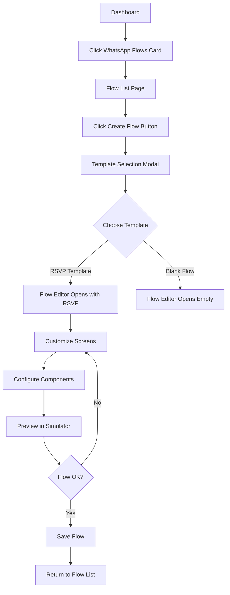
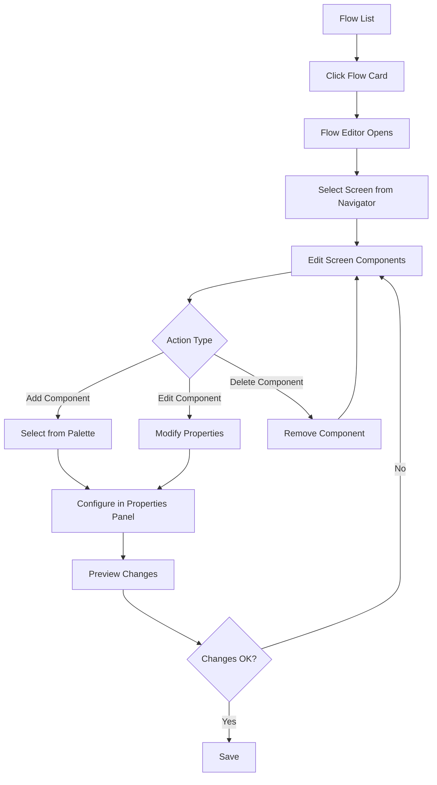
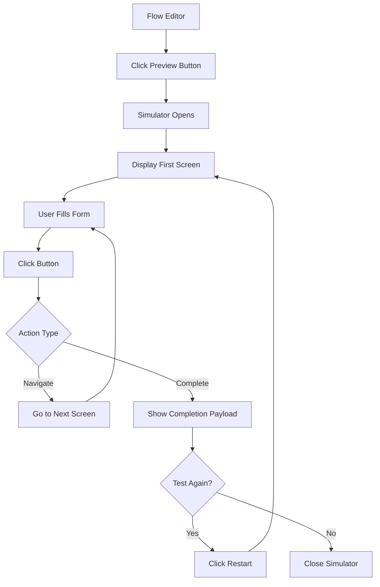

# WhatsApp Flow Studio - UX Documentation

## Overview

WhatsApp Flow Studio adalah visual editor untuk membuat WhatsApp Flows yang memungkinkan admin untuk:
- Membuat dan mengelola flows untuk RSVP, registrasi, dan data collection
- Mendesain screens dengan drag-and-drop components
- Mengkonfigurasi form inputs, validations, dan actions
- Preview flows dalam WhatsApp-like simulator
- Export/import Flow JSON

---

## User Personas

### Primary User: Event Admin
- **Role**: Wedding/event organizer menggunakan Balemoo
- **Goals**: 
  - Membuat RSVP form untuk guests
  - Collect guest data (nama, kehadiran, jumlah tamu)
  - Preview flow sebelum deploy
- **Pain Points**:
  - Tidak familiar dengan JSON atau coding
  - Butuh visual interface yang intuitif
  - Perlu preview untuk memastikan flow bekerja dengan benar

---

## Main User Flows

### 1. Creating a New Flow from Template

**Step-by-Step:**

1. **Dashboard** → User sees "WhatsApp Flows" card
2. **Click Card** → Navigate to Flow List
3. **Create Flow** → Click "+ Create Flow" button
4. **Template Modal** → Choose from:
   - RSVP Template (recommended)
   - Blank Flow
5. **Flow Editor** → Opens with template screens loaded
6. **Customize** → Edit screens, components, properties
7. **Preview** → Test flow in simulator
8. **Save** → Auto-save or manual save

---

### 2. Editing Existing Flow

---

### 3. Previewing Flow in Simulator

---

## Screen Layouts

### Flow List Dashboard

**Layout Components:**

**Header Bar**
- Title: "WhatsApp Flows"
- Search bar (filter by name)
- Filter dropdown (All, Draft, Published)
- "+ Create Flow" button (primary action)

**Flow Cards Grid**
- Card per flow showing:
  - Flow name (editable on hover)
  - Status badge (Draft/Published)
  - Category tag
  - Last modified date
  - Preview thumbnail (first screen)
  - Actions: Edit, Duplicate, Delete, Preview
- Empty state: "No flows yet. Create your first flow!"

---

### Flow Editor - Three Panel Layout

#### Left Sidebar - Screen Navigator (20% width)

**Header**
- "Screens" title
- "+ Add Screen" button

**Screen List**
- Each screen shows:
  - Screen ID (e.g., "WELCOME")
  - Mini preview of screen
  - Terminal indicator (✓ icon if terminal screen)
  - Active/selected state (blue border)
- Drag to reorder (future)
- Click to select and edit

**Actions per Screen**
- Edit icon (rename)
- Delete icon (with confirmation)
- Duplicate icon

---

#### Center Canvas - Screen Editor (50% width)

**Top Toolbar**
- Flow name (editable inline)
- Save button (with auto-save indicator)
- Validate button (shows validation status)
- Preview button (opens simulator)
- Export/Import dropdown

**Screen Title**
- Screen ID and title (editable)
- Screen settings icon (terminal, success flags)

**Component List**
- Visual representation of each component:
  - Component type badge (e.g., "TextHeading")
  - Component content preview
  - Drag handle (⋮⋮ icon)
  - Delete icon (trash)
  - Selection border when selected
- Vertical layout matching WhatsApp flow order

**Bottom Actions**
- "+ Add Component" button (opens component palette)

---

#### Right Sidebar - Properties Panel (30% width)

**Header**
- "Properties" title
- Component type indicator

**Screen Properties** (when no component selected)
- Screen ID (text input)
- Title (text input)
- Terminal (checkbox)
- Success (checkbox)
- Refresh on back (checkbox)

**Component Properties** (when component selected)

*Varies by component type, example for TextInput:*
- Label (text input)
- Input Type (dropdown: text, email, phone, number, etc.)
- Required (toggle)
- Min Characters (number input)
- Max Characters (number input)
- Helper Text (text input)
- Error Message (text input)
- Pattern (text input for regex)
- Initial Value (text input)

*Example for Footer (Button):*
- Label (text input)
- Action Type (dropdown: navigate, complete, data_exchange)
- Next Screen (dropdown, if navigate)
- Payload (JSON editor, if complete/data_exchange)
- Enabled (toggle)

**Save Button**
- "Save Changes" button at bottom

---

### Flow Simulator

**Phone Frame**
- iPhone-style frame with rounded corners
- Status bar (time, battery, signal)
- WhatsApp header (green #25D366)
  - Back arrow
  - Flow name
  - Three dots menu

**Chat Area**
- WhatsApp background (#ECE5DD with pattern)
- Flow message bubble (white, rounded, shadow)
- Components rendered with WhatsApp styling:
  - Text components (heading, body, caption)
  - Input fields (native WhatsApp style)
  - Buttons (WhatsApp blue or custom color)
  - Radio buttons, checkboxes
  - Date pickers, dropdowns

**Form State**
- Live form validation
- Error messages below fields
- Required field indicators (*)

**Bottom Controls**
- "← Back" button (go to previous screen)
- "Restart Flow" button (reset to first screen)
- "Close Preview" button (close simulator)

**Completion State**
- When flow completes:
  - Success message
  - Payload display (JSON viewer)
  - "Restart" button

---

## Component Palette

### Organization

Components grouped by category:

**📝 Text Components**
- TextHeading
- TextSubheading
- TextBody
- TextCaption

**✏️ Input Components**
- TextInput
- TextArea
- RadioButtonsGroup
- CheckboxGroup
- Dropdown
- DatePicker
- CalendarPicker

**🔘 Interactive Components**
- Footer (Button)
- OptIn
- EmbeddedLink
- Image
- ImageCarousel

**🔀 Logic Components**
- If (Conditional)
- Switch (Multiple conditions)

### Component Card Design

Each component shows:
- Icon representing component type
- Component name
- Brief description
- Click to add to current screen

---

## Interaction Patterns

### Adding a Component

1. **Click "+ Add Component"** in screen editor
2. **Component Palette** appears (modal or sidebar)
3. **Select Component** from list
4. **Component Added** to bottom of screen
5. **Properties Panel** auto-opens with component selected
6. **Configure Properties** in properties panel
7. **Component Updates** in real-time in editor

### Configuring Component Properties

1. **Select Component** in screen editor (click)
2. **Properties Panel** shows component-specific fields
3. **Edit Properties** (text inputs, dropdowns, toggles)
4. **Live Preview** updates in editor
5. **Validation** shows errors if invalid
6. **Auto-save** after debounce (2 seconds)

### Setting Up Actions

1. **Select Footer Component** (button)
2. **Properties Panel** shows action configuration
3. **Choose Action Type**:
   - **Navigate**: Select next screen from dropdown
   - **Complete**: Configure payload (JSON editor)
   - **Data Exchange**: Configure endpoint and payload
4. **Test in Simulator** to verify action works

### Reordering Components

1. **Hover over Component** in screen editor
2. **Drag Handle** appears (⋮⋮ icon)
3. **Drag Component** up or down
4. **Drop** in new position
5. **Order Updates** automatically

---

## Templates

### RSVP Template Structure

**Screen 1: WELCOME**
- TextHeading: "RSVP untuk Pernikahan Kami"
- TextBody: "Mohon isi data kehadiran Anda"
- Footer: "Mulai" → Navigate to GUEST_INFO

**Screen 2: GUEST_INFO**
- TextHeading: "Informasi Tamu"
- TextInput: "Nama Lengkap" (required)
- TextInput: "Nomor Telepon" (required, type: phone)
- TextInput: "Email" (optional, type: email)
- Footer: "Lanjut" → Navigate to ATTENDANCE

**Screen 3: ATTENDANCE**
- TextHeading: "Konfirmasi Kehadiran"
- RadioButtonsGroup: "Apakah Anda akan hadir?"
  - Option 1: "Ya, saya akan hadir"
  - Option 2: "Maaf, saya tidak bisa hadir"
- If (attendance == "yes"):
  - TextInput: "Jumlah Tamu" (type: number)
- Footer: "Lanjut" → Navigate to CONFIRMATION

**Screen 4: CONFIRMATION**
- TextHeading: "Terima Kasih!"
- TextBody: "RSVP Anda telah kami terima"
- TextCaption: "Kami tunggu kehadiran Anda"
- Footer: "Selesai" → Complete (terminal: true, success: true)

---

## Validation & Error Handling

### Client-side Validation

**Screen Level:**
- Screen ID must be unique
- Screen ID must be uppercase with underscores
- At least one screen required
- First screen cannot be terminal

**Component Level:**
- Required fields must be filled
- Character limits enforced
- Pattern validation (email, phone, etc.)
- Action references must point to existing screens

**Flow Level:**
- All screens must be reachable
- No circular dependencies
- Terminal screens must have success flag
- At least one terminal screen required

### Error Display

**Validation Errors:**
- Red border around invalid field
- Error message below field
- Error icon in properties panel
- Validation summary in toolbar

**Save Errors:**
- Toast notification with error message
- Retry button
- Error log in console

---

## Accessibility

### Keyboard Navigation
- Tab through all interactive elements
- Enter to activate buttons
- Arrow keys to navigate lists
- Escape to close modals

### Screen Reader Support
- ARIA labels on all interactive elements
- Semantic HTML structure
- Focus management for modals
- Status announcements for actions

### Visual Accessibility
- High contrast mode support
- Sufficient color contrast (WCAG AA)
- Focus indicators on all interactive elements
- Icon + text labels for clarity

---

## Performance Considerations

### Auto-save Strategy
- Debounce saves (2 seconds after last edit)
- Visual indicator of save status
- Optimistic UI updates
- Error recovery for failed saves

### Large Flows
- Virtualized screen list (if > 20 screens)
- Lazy load component configurations
- Pagination for flow list
- Search/filter optimization

---

## Mobile Responsiveness

While the Flow Studio is primarily for desktop use, the simulator should be responsive:

**Desktop (> 1024px)**
- Full three-panel layout
- Simulator in modal overlay

**Tablet (768px - 1024px)**
- Collapsible sidebars
- Simulator full screen

**Mobile (< 768px)**
- Single panel view with tabs
- Simulator native full screen

---

## Future Enhancements

### Advanced Features (Not in MVP)
- **Drag & Drop**: Visual drag-and-drop for components
- **Conditional Logic Builder**: Visual if/else builder
- **Data Binding UI**: Visual data mapping interface
- **Collaboration**: Real-time multi-user editing
- **Version History**: Flow version control
- **Analytics**: Flow performance metrics
- **A/B Testing**: Test different flow variations
- **Localization**: Multi-language support

### Meta API Integration (Future)
- **Publish to WhatsApp**: Direct publish to Meta
- **Flow Status Sync**: Sync status with Meta
- **Webhook Configuration**: Set up data endpoints
- **Flow Analytics**: View Meta analytics

---

## Summary

WhatsApp Flow Studio provides an intuitive visual interface for creating WhatsApp Flows without requiring JSON knowledge. The three-panel layout (screen navigator, editor canvas, properties panel) combined with a WhatsApp-like simulator enables admins to create, customize, and test flows efficiently.

Key UX principles:
- **Visual-first**: No JSON editing required
- **Immediate feedback**: Live preview and validation
- **Template-driven**: Quick start with RSVP template
- **WhatsApp-authentic**: Simulator matches real WhatsApp UI
- **Forgiving**: Auto-save, undo, validation guidance

